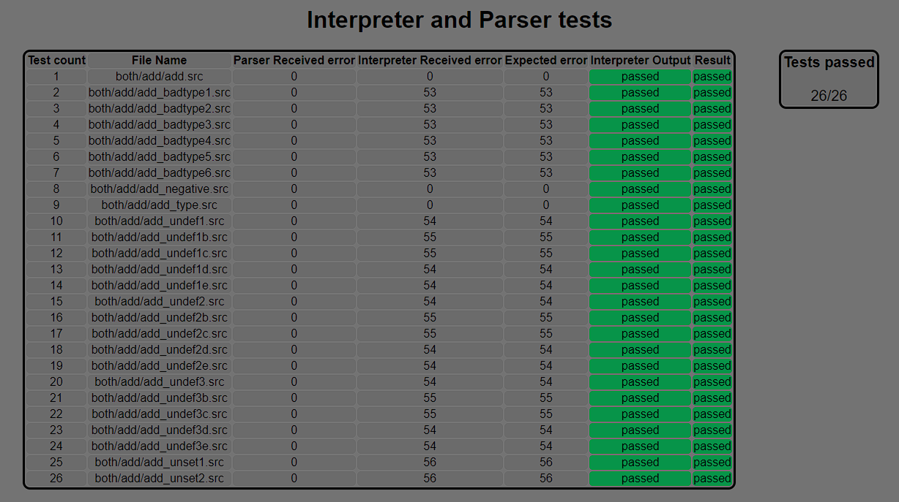

# Implementation documentation for IPP project 2021/2022 (second half)

##### Name: Tomáš Dvořák
##### Login: xdvora3r

---

## Implementation details of interpreter

#### Frames and stack structures
The first and probably the most important are the frames. The frames are implemented via a class called `Frames`. (It was too late when I realized that a dictionary would be more fitting for this implementation). Some attributes behave like stack. Specifically it is: `local_frame`, `call_stack` and `stack`. The rest of the attributes are simple lists. Inbuilt functions like `del` and methods like `.append()` are used for manipulating with the lists. The script works with every type and variable as a string. So a variable internally is represented like this: `['frame@name', 'type', 'value']`. An example of variables in frames would look something like this:

```
Global frame:   [['GF@a', 'int', '50'], ['GF@b', 'string', 'Hello\032World']]
Local frame:    [[['LF@A'], ['LF@B', 'int', '11']], [['LF@A'], ['LF@B', 'bool', 'true']]]
Temp frame:     [['TF@a', 'bool', 'true'], ['TF@b', 'nil', 'nil']]
```

The local frame is special in this case, since it is composed of three lists. The first list is the frame itself, second lists are pushed temporary frames and variables are stored in a list of their own.
As a side note, escaped sequences are converted before insertion to a variable, so `Hello\032World` is actually represented as `Hello World` inside a variable.

#### Multiple run-throughs
The interpreter runs through the XML code a few times. The first few run-throughs check the correct XML structure, sort opcodes by the order number, sort arguments by numbers, check the correct order type, insert read labels into label list and much more. Labels consist of a name and the index where the label lies inside the code. An example of label list:

```
Labels: [[forcycle, '4'], [jump, '15'], [while, '55']]
```

After the structure has been checked, actual interpreting can begin. I have chosen a switch-like structure for selecting and executing operands.

#### Interpretation run
The interpretation run consists of a root parsed via the `xml.etree.ElementTree` library and a while that iterates through the tree. Jumps set the index to the index of labels, that are inside the label list. Function `CALL` works fundamentally the same, except it uses `call_stack` for storing the index where the call function was called.
Each iteration goes through an instruction (xml), gets its arguments and stores them inside an `Instruction` class. After that, the execution can begin. Most used functions are: `get_val()`, `get_type()`, `var_find_index()` and `insert_into_var()`. More information about these can be read about inside the code.

---

## Implementation details of tester

#### Code implementation
The script is composed of many functions nested together. I've found a `RecursiveDirectoryIterator` class that allows the script to iterate through files via a for cycle. First, the script loads all the options the user inserted with the `getopt` function. Then the script checks for any `.src` files, if any are present (and exist), it will generate/read all the other necessary files. After all that, the testing may begin.

#### Script output
The script outputs messages to `STDERR` with the help of `error_log`, may it be a non existing file, or `int-only` and `parse-only` options together. The script also outputs testing messages. A succesful test run looks like this:

```
Running test: ./path/test.src test number: *number*
*Test output*
Parser/Interpreter Status: *passed/failed*

Tests passed: *number*
Tests failed: *number*
```

#### HTML details
The HTML test script was influenced by a colleague, who showed me his HTML output. I know him personally and I really liked his design and I've added a few missing features and removed some unnecessary information. For example, you can clearly see: the path of the test, the received error code, the expected error code, if the output difference has passed/failed and the overall result of the test. In the top right corner,  you can see the total amount of tests passed, for easy debugging.


